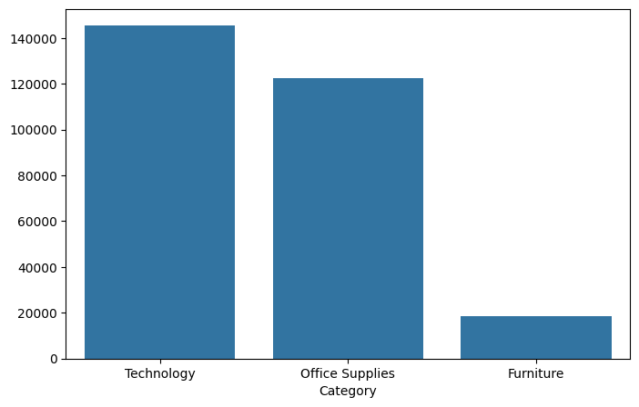
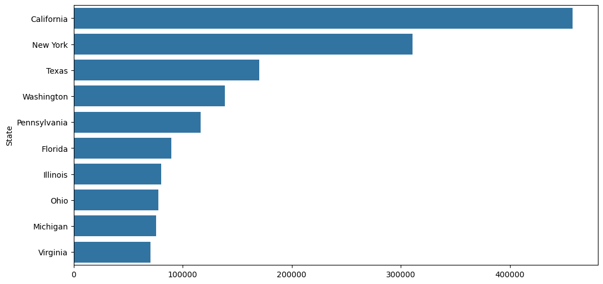
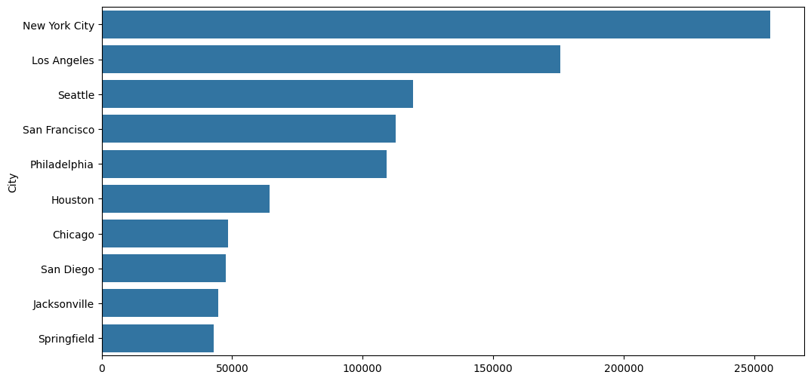

# 📊 Retail Sales Analytics Dashboard


---

# 🚀 Project Overview

The Retail Sales Analytics Dashboard is an Exploratory Data Analysis (EDA) project built using Python, Pandas, NumPy, Matplotlib, and Seaborn.

The objective of this project is to analyze retail sales data, uncover business insights, identify profitable regions and categories, evaluate the impact of discounts on profits, and visualize important trends through interactive charts and statistical analysis.

This project demonstrates real-world data analytics skills including:

✅ Data Cleaning

✅ Data Exploration

✅ Business Intelligence

✅ Statistical Analysis

✅ Data Visualization

✅ Insight Generation

---

# 📂 Dataset Information

Dataset: Sample Superstore Dataset

Total Records: 9,994

Total Features: 13

Columns Included:

* Ship Mode
* Segment
* Country
* City
* State
* Postal Code
* Region
* Category
* Sub-Category
* Sales
* Quantity
* Discount
* Profit

---

# 🛠️ Technologies Used

| Technology       | Purpose                   |
| ---------------- | ------------------------- |
| Python           | Programming Language      |
| Pandas           | Data Cleaning & Analysis  |
| NumPy            | Numerical Computations    |
| Matplotlib       | Data Visualization        |
| Seaborn          | Statistical Visualization |
| Jupyter Notebook | Development Environment   |
| Git              | Version Control           |
| GitHub           | Project Hosting           |

---

# 📁 Project Structure

```text
Retail-Sales-Analytics/
│
├── data/
│   └── SampleSuperstore.csv
│
├── images/
│   ├── sales_by_category.png
│   ├── profit_by_category.png
│   ├── top_states.png
│   ├── Top_city.png
│   ├── correlation_heatmap.png
│
├── notebooks/
│   └── Retail-Sales-Analytics.ipynb
│
├── README.md
│
├── requirements.txt
│
└── .gitignore
```

---

# 🧹 Data Cleaning Process

The following preprocessing steps were performed:

* Missing Value Analysis
* Duplicate Record Detection
* Duplicate Removal
* Data Type Verification
* Statistical Summary Generation
* Numerical Feature Analysis
* Outlier Detection

---

# 📊 Exploratory Data Analysis

## 1️⃣ Sales Analysis

Business Questions:

* Which category generates the highest revenue?
* Which states contribute the most sales?
* Which cities generate the highest revenue?
* Which region performs the best?

Analysis Performed:

* Category-wise Sales
* State-wise Sales
* City-wise Sales
* Region-wise Sales

---

## 2️⃣ Profit Analysis

Business Questions:

* Which category generates the highest profit?
* Which category suffers losses?
* Which states are most profitable?
* How do discounts impact profitability?

Analysis Performed:

* Category-wise Profit
* Profit Distribution
* Profit Margin Analysis
* Loss Making Categories

---

## 3️⃣ Customer Segment Analysis

Business Questions:

* Which customer segment contributes most revenue?
* Which segment generates highest profit?

Analysis Performed:

* Segment Distribution
* Segment Revenue Analysis
* Segment Profit Analysis

---

## 4️⃣ Shipping Analysis

Business Questions:

* Which shipping mode is most frequently used?
* Which shipping mode generates the highest profit?

Analysis Performed:

* Ship Mode Distribution
* Ship Mode Profitability

---

## 5️⃣ Discount Analysis

Business Questions:

* Does higher discount increase sales?
* Does discount reduce profitability?

Analysis Performed:

* Discount vs Profit Scatter Plot
* Average Profit by Discount

---

# 📈 Visualizations

## Sales by Category

This chart compares total sales generated by each product category.


### Insight

Technology contributes the highest revenue among all categories.

---

## Profit by Category

This chart displays category-wise profitability.



### Insight

Technology is the most profitable category while some categories contribute lower profit despite high sales.

---

## Top States by Sales

This visualization highlights the states generating the highest sales revenue.



### Insight

A small number of states contribute a large percentage of overall sales.

---

## Top Cities by Sales

This chart identifies the highest-performing cities based on revenue.



### Insight

Major metropolitan cities dominate retail sales performance.

---

## Correlation Heatmap

Correlation matrix between numerical variables.


### Insight

Sales and Profit have a positive relationship, while Discount negatively impacts profitability.

---

# 📉 Statistical Analysis

NumPy was used to calculate:

* Mean Sales
* Median Sales
* Standard Deviation
* Maximum Sales
* Minimum Sales
* Average Profit

Example:

```python
np.mean(df["Sales"])
np.median(df["Sales"])
np.std(df["Sales"])
```

---

# 🔥 Key Business Insights

### Insight 1

Technology generates the highest sales revenue.

### Insight 2

High discounts frequently result in reduced profit.

### Insight 3

Certain sub-categories consistently generate losses.

### Insight 4

Sales concentration is highest among a few major states and cities.

### Insight 5

Customer segments contribute differently to overall profitability.

### Insight 6

Profitability depends on both sales volume and discount strategy.

---

# 📓 Notebook

Complete Analysis Notebook:

```text
notebooks/Retail-Sales-Analytics.ipynb
```

---


```text
Retail-Sales-Analytics.ipynb
```

---

# 📌 Future Improvements

* Power BI Dashboard
* Streamlit Dashboard
* Sales Forecasting
* Customer Segmentation
* Predictive Analytics
* Machine Learning Integration

---

# 👨‍💻 Author

**Pawan Jogi**

Data Analytics | Data Science | Python | SQL | Power BI

GitHub:
https://github.com/PawanJogi07

---

